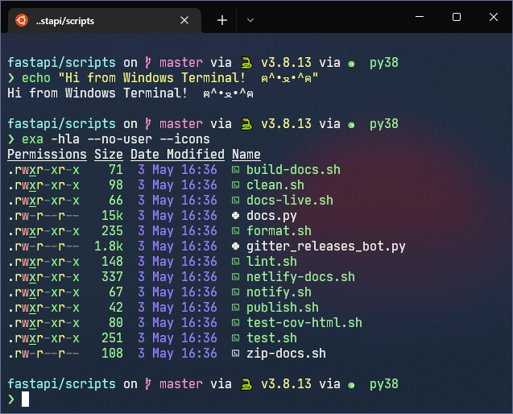

# My Terminal

The applied terminal varies by the host OS:

- [🍎 iTerm2](#-iterm2)
  - [🎨 Appearance](#-appearance)
  - [👨‍💻 Zsh settings](#-zsh-settings)
    - [Plugins](#plugins)
    - [Shell aliases](#shell-aliases)
- [🖥 Windows Terminal](#-windows-terminal)
  - [🎨 Appearance](#-appearance-1)
  - [👨‍💻 Profiles](#-profiles)
    - [Command Prompt](#command-prompt)
    - [Git Bash](#git-bash)
    - [PowerShell 7](#powershell-7)
    - [WSL - Ubuntu 22.04 (LTS)](#wsl---ubuntu-2204-lts)

Additionally, you can find my IDE (VS Code) settings [here](https://pawelcislo.com/2021/11/14/my-vs-code-playground/).

## 🍎 iTerm2

[iTerm2](https://iterm2.com/) - my main terminal for macOS.

### 🎨 Appearance


- Theme: [Dracula PRO](https://draculatheme.com/pro)
- iTerm2 theme size: `Compact`
- Font: [JetBrains Mono](https://github.com/JetBrains/JetBrainsMono) 12

### 👨‍💻 Zsh settings

- Framework: [Oh My Zsh](https://ohmyz.sh/)
- Prompt: [Starship](https://starship.rs/)
  - If you have installed conda, I suggest to disable printing environment names, as they will be displayed already by Starship: `conda config --set changeps1 False`

#### Plugins

Oh My Zsh plugins:

- [docker](https://github.com/ohmyzsh/ohmyzsh/tree/master/plugins/docker)
- [dotenv](https://github.com/ohmyzsh/ohmyzsh/tree/master/plugins/dotenv)
- [git](https://github.com/ohmyzsh/ohmyzsh/tree/master/plugins/git)
- [kubectl](https://github.com/ohmyzsh/ohmyzsh/tree/master/plugins/kubectl)
- [pip](https://github.com/ohmyzsh/ohmyzsh/tree/master/plugins/pip)
- [poetry](https://github.com/ohmyzsh/ohmyzsh/tree/master/plugins/poetry)
- [python](https://github.com/ohmyzsh/ohmyzsh/tree/master/plugins/python)
- [sudo](https://github.com/ohmyzsh/ohmyzsh/tree/master/plugins/sudo)
- [virtualenv](https://github.com/ohmyzsh/ohmyzsh/tree/master/plugins/virtualenv)

External plugins:

- [zsh-autosuggestions](https://github.com/zsh-users/zsh-autosuggestions) <--- fish-like autosuggestions for Zsh
- [zsh-syntax-highlighting](https://github.com/zsh-users/zsh-syntax-highlighting) <--- fish shell like syntax highlighting for Zsh

#### Shell aliases

- `alias h="history | grep"` <--- search shell command history using grep
- `alias lisl="exa -hla --icons"` <--- better `ls` with [exa](https://github.com/ogham/exa)
- `alias list="exa -hlas time --icons"` <--- better `ls` with [exa](https://github.com/ogham/exa) (ordered by time)
- `alias tree="br -c :pt"` <--- better `tree` with [broot](https://github.com/Canop/broot)

Additionally, you can find a list of my recommended shell tools [here](https://github.com/pyxelr/recommendations-for-engineers#shell).

## 🖥 Windows Terminal

[Windows Terminal](https://github.com/microsoft/terminal) - my main terminal for Windows.

### 🎨 Appearance



- Theme: [Dracula PRO](https://draculatheme.com/pro) (with `"brightBlack": "#8F89B4"` as I have reasoned [here](https://github.com/dracula/dracula-theme/discussions/715))
- Background opacity: `80%`
- Font: [JetBrains Mono](https://github.com/JetBrains/JetBrainsMono) 11

### 👨‍💻 Profiles

#### Command Prompt

- Bash's editing: [Clink](https://github.com/chrisant996/clink)
- Prompt: [Starship](https://starship.rs/)
- Sudo for Windows: [gsudo](https://github.com/gerardog/gsudo)

#### Git Bash

Install Git Bash from [here](https://git-scm.com/downloads).

Add profile to Windows Terminal:

- Name: `Git Bash`
- Command line: `%PROGRAMFILES%/Git/bin/bash.exe -i -l`
- Starting directory: `%USERPROFILE%`
- Icon: `%PROGRAMFILES%/Git/mingw64/share/git/git-for-windows.ico`

Extras:

- Prompt: [Starship](https://starship.rs/)
- To be able to activate conda environments, you may also need to set a system variable: `PYTHONIOENCODING=utf8`

`.bash_profile`:

```sh
# Set Starship theme
eval "$(starship init bash)"

# >>> conda initialize >>>
# !! Contents within this block are managed by 'conda init' !!
eval "$('/c/Users/pawel/miniconda3/Scripts/conda.exe' 'shell.bash' 'hook')"
# <<< conda initialize <<<
```

#### PowerShell 7

I am using [PowerShell 7](https://docs.microsoft.com/en-us/powershell/scripting/install/installing-powershell-on-windows?view=powershell-7.2#installing-from-the-microsoft-store) in addition to the native Windows PowerShell 5.

Extras:

- Prompt: [Starship](https://starship.rs/)
- Sudo for Windows: [gsudo](https://github.com/gerardog/gsudo)

`$PROFILE`:

```powershell
# Set Starship
Invoke-Expression (&starship init powershell)

# Show navigable menu of all options when hitting Tab
Set-PSReadlineKeyHandler -Key Tab -Function MenuComplete

# Autocompletion for arrow keys
Set-PSReadlineKeyHandler -Key UpArrow -Function HistorySearchBackward
Set-PSReadlineKeyHandler -Key DownArrow -Function HistorySearchForward
```

#### WSL - Ubuntu 22.04 (LTS)

Install Ubuntu:

1. Set a default version of WSL: `wsl --set-default-version 2`.
2. Install [Ubuntu 22.04 LTS](https://www.microsoft.com/store/productId/9PN20MSR04DW).

Setup the environment:

1. Start with `sudo apt update` and `sudo apt upgrade`.
2. Install [Zsh](https://www.zsh.org/), [Oh My Zsh](https://github.com/ohmyzsh/ohmyzsh) and [Starship](https://github.com/starship/starship).
3. Copy the [👨‍💻 Zsh settings](#-zsh-settings).

Extras:

- Disable beep sound in Windows Terminal settings for the Ubuntu Profile (`Advanced` > `Bell notification style`)
- If you have installed conda, I suggest to disable printing environment names, as they will be displayed already by Starship: `conda config --set changeps1 False`.
